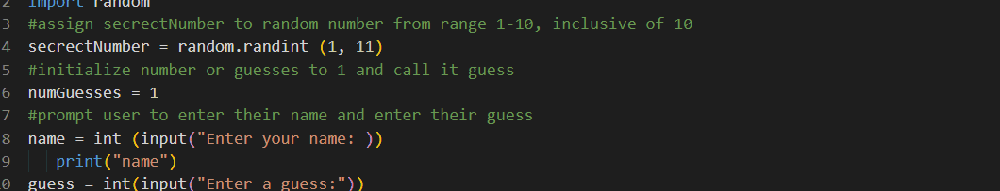

# Python-Hw1
## Use random generator and assign it to a variable
# Number Guessing  Game
# assign secrectNumber to random number from range 1-11, so its inclusive of 10

# initialize number or guesses to 1 and call it guess

# prompt user to enter their name and enter their guess by using input

# create a while loop thats exits when the guess is equal to the secrect number
# if the guess is not equal to the secrect number, do the while loop.
# guess the secrectNumber: if guess is > than secrect number the user is will recieve an alert that the number is less than guess
# if guess is < than secrect number the user is will recieve an alert the number is greater than guess
 

    
        
# if the guess is not equal to the secrect number, guess again. The user is prompted to ebnter a number
        
## tell the user  how may tries it took them to guess the correct number
*printed a congrats message when its correct. Used concatenation and the secrect number variable
*printed a mesage to the user to tell how many guesses to took to guess correctly
        
      

   

